# 🔍 Análisis de Implementación Actual y Propuesta de Solución Robusta

**Fecha:** 2026-02-23  
**Autor:** Arquitecto Lead  
**Versión:** 1.0

---

## 1. ANÁLISIS DE LA IMPLEMENTACIÓN ACTUAL

### 1.1 Arquitectura Actual


### 1.2 Archivos Clave Analizados

| Archivo | Propósito | Estado |
|---------|-----------|--------|
| [`hooks/useDashboardData.ts`](hooks/useDashboardData.ts) | Hook personalizado con caché | ✅ Funcional pero mejorable |
| [`services/cacheService.ts`](services/cacheService.ts) | Servicio de caché SWR | ✅ Funcional pero básico |
| [`services/noco.ts`](services/noco.ts) | Cliente API NocoDB | ⚠️ Paginación limitada |
| [`App.tsx`](App.tsx) | Integración principal | ⚠️ UX de carga bloqueante |

### 1.3 Problemas Identificados

#### 🔴 Problema 1: Carga Secuencial con Delays

**Ubicación:** [`cacheService.ts:88-104`](services/cacheService.ts:88)

```typescript
// Carga secuencial con delays para evitar rate limiting
const DELAY_BETWEEN_REQUESTS = 200;
const delay = (ms: number) => new Promise(resolve => setTimeout(resolve, ms));

const sellers = await getRealSellers();
await delay(DELAY_BETWEEN_REQUESTS);  // 200ms perdido

const sales = await getRealSales();
await delay(DELAY_BETWEEN_REQUESTS);  // 200ms perdido

// ... más llamadas con delays
```

**Impacto:** 
- Mínimo 800ms perdidos en delays artificiales
- Tiempo total de carga: 2-4 segundos en producción

#### 🔴 Problema 2: Filtrado Client-Side

**Ubicación:** [`cacheService.ts:225-248`](services/cacheService.ts:225)

```typescript
export const filterByDateRange = (
    data: CachedData,
    startDate: Date,
    endDate: Date
) => {
    // Filtra TODOS los datos en memoria
    return {
        contacts: data.contacts, // No se filtran
        interactions: data.interactions.filter(i => isWithinRange(i.date)),
        sales: data.sales.filter(s => isWithinRange(s.date)),
        attempts: data.attempts.filter(a => isWithinRange(a.date)),
    };
};
```

**Impacto:**
- Se traen TODOS los registros de NocoDB (27,676 contactos, 10,524 interacciones)
- Desperdicio de ancho de banda y memoria
- NocoDB soporta filtrado server-side con parámetro `where`

#### 🔴 Problema 3: Paginación Limitada

**Ubicación:** [`noco.ts:160-161`](services/noco.ts:160)

```typescript
const limit = 1000;  // NocoDB ignora esto, usa 100 como máximo interno
```

**Impacto:**
- NocoDB tiene límite interno de 100 registros por página
- Si hay más de 100 registros, se necesitan múltiples llamadas
- El código ya maneja paginación, pero no es eficiente

#### 🔴 Problema 4: UX de Carga Bloqueante

**Ubicación:** [`App.tsx:146-150`](App.tsx:146)

```typescript
{isInitialLoad ? (
    <div className="flex flex-col justify-center items-center h-64 space-y-4">
        <div className="animate-spin rounded-full h-12 w-12 border-b-2 border-gold-500"></div>
        <p className="text-sm text-gray-500">Cargando datos desde NocoDB...</p>
    </div>
) : (
    // ... contenido
)}
```

**Impacto:**
- Spinner bloqueante durante toda la carga
- No hay feedback visual de progreso
- No hay skeleton loading

#### 🟡 Problema 5: Cache Sin TTL Diferenciado

**Ubicación:** [`cacheService.ts:33-40`](services/cacheService.ts:33)

```typescript
const CACHE_CONFIG = {
    STALE_TIME: 5 * 60 * 1000,      // 5 minutos para TODOS los datos
    MAX_AGE: 30 * 60 * 1000,        // 30 minutos para TODOS los datos
    REVALIDATE_INTERVAL: 5 * 60 * 1000,
};
```

**Impacto:**
- Vendedoras (datos estáticos) se recargan igual que ventas (datos dinámicos)
- No hay prefetch de datos probables

---

## 2. PROPUESTA DE SOLUCIÓN ROBUSTA

### 2.1 Arquitectura Propuesta

```mermaid
graph TB
    subgraph Frontend Mejorado
        A[App.tsx] --> B[useDashboardData Hook]
        B --> C[cacheService v2]
        C --> D[noco.ts con where]
        D --> E[NocoDB API]
    end
    
    subgraph Mejoras
        F[Carga Paralela] --> G[Promise.all]
        H[Filtrado Server-Side] --> I[Parametro where]
        J[Actualización Optimista] --> K[Mostrar cache + reload]
        L[Skeleton Loading] --> M[UI no bloqueante]
        N[Cache Inteligente] --> O[TTL diferenciado]
    end
```



### 2.2 Mejoras Propuestas

#### ✅ Mejora 1: Filtrado Server-Side con Parámetro `where`

**Concepto:** Usar el parámetro `where` de NocoDB para filtrar en el servidor.

**Sintaxis NocoDB:**
```
(where,Fecha,btw,2026-02-01,2026-02-28)
```

**Implementación en [`noco.ts`](services/noco.ts):**

```typescript
// Nueva función para construir filtros de fecha
const buildDateFilter = (startDate: Date, endDate: Date, fieldName: string): string => {
    const start = startDate.toISOString().split('T')[0];
    const end = endDate.toISOString().split('T')[0];
    return `&where=(${fieldName},btw,${start},${end})`;
};

// Modificar fetchFromProxy para aceptar filtros
const fetchFromProxy = async <T>(
    endpoint: string, 
    label: string,
    dateFilter?: { start: Date; end: Date; field: string }
): Promise<T[]> => {
    // ... código existente ...
    
    const dateFilterParam = dateFilter 
        ? buildDateFilter(dateFilter.start, dateFilter.end, dateFilter.field)
        : '';
    
    url = `${NOCODB_CONFIG.BASE_URL}/api/v2/tables/${tableId}/records?limit=${limit}&offset=${offset}${getSortParam(endpoint)}${dateFilterParam}`;
    
    // ... resto del código ...
};
```

**Beneficios:**
- Reduce drásticamente la cantidad de datos transferidos
- NocoDB hace el filtrado en el servidor (más eficiente)
- Tiempo de carga reducido de segundos a milisegundos

#### ✅ Mejora 2: Carga Paralela con Promise.all

**Concepto:** Eliminar delays secuenciales y cargar en paralelo.

**Implementación en [`cacheService.ts`](services/cacheService.ts):**

```typescript
// ANTES (secuencial con delays)
const sellers = await getRealSellers();
await delay(200);
const sales = await getRealSales();
await delay(200);
// ... tiempo total: ~2-4 segundos

// DESPUÉS (paralelo)
const [sellers, sales, contacts, interactions, attempts] = await Promise.all([
    getRealSellers(),
    getRealSales(dateFilter),
    getRealContacts(),
    getRealInteractions(dateFilter),
    getRealAttempts(dateFilter),
]);
// ... tiempo total: ~500ms-1 segundo (el más lento determina el tiempo)
```

**Consideración:** Si hay rate limiting de NocoDB, usar `Promise.allSettled` con reintentos:

```typescript
const fetchWithRetry = async <T>(fn: () => Promise<T>, retries = 3): Promise<T> => {
    for (let i = 0; i < retries; i++) {
        try {
            return await fn();
        } catch (error) {
            if (i === retries - 1) throw error;
            await new Promise(resolve => setTimeout(resolve, 100 * Math.pow(2, i)));
        }
    }
    throw new Error('Max retries reached');
};

const results = await Promise.allSettled([
    fetchWithRetry(() => getRealSellers()),
    fetchWithRetry(() => getRealSales(dateFilter)),
    // ...
]);
```

#### ✅ Mejora 3: Actualización Optimista

**Concepto:** Mostrar datos cacheados inmediatamente mientras se cargan nuevos.

**Implementación en [`useDashboardData.ts`](hooks/useDashboardData.ts):**

```typescript
interface UseDashboardDataResult {
    // ... campos existentes ...
    
    // Nuevos estados
    isRefreshing: boolean;      // True mientras revalida en background
    isStale: boolean;           // True si los datos son antiguos
    lastUpdated: Date | null;   // Última actualización
}

export function useDashboardData(
    startDate: Date,
    endDate: Date
): UseDashboardDataResult {
    const [isRefreshing, setIsRefreshing] = useState(false);
    
    // Función para cargar datos con actualización optimista
    const loadWithOptimisticUpdate = useCallback(async () => {
        // 1. Mostrar datos cacheados inmediatamente (si existen)
        const cachedData = getCacheState().data;
        if (cachedData) {
            const filtered = filterByDateRange(cachedData, startDate, endDate);
            setFilteredData(filtered);
            setIsInitialLoad(false); // Mostrar UI inmediatamente
        }
        
        // 2. Cargar datos nuevos en background
        setIsRefreshing(true);
        try {
            const newData = await getData(true); // force refresh
            if (mountedRef.current && newData) {
                const filtered = filterByDateRange(newData, startDate, endDate);
                setFilteredData(filtered);
            }
        } finally {
            if (mountedRef.current) {
                setIsRefreshing(false);
            }
        }
    }, [startDate, endDate]);
    
    return {
        ...filteredData,
        sellers,
        isLoading: isInitialLoad && !getCacheState().data, // Solo true si no hay cache
        isRefreshing, // Nuevo: para mostrar indicador sutil
        isDemo,
        error,
        refresh,
        isInitialLoad,
        lastUpdated: cacheState.data?.timestamp ? new Date(cacheState.data.timestamp) : null,
    };
}
```

**UI en [`App.tsx`](App.tsx):**

```typescript
// Indicador sutil de actualización en header
<button onClick={refresh} disabled={isRefreshing} className="...">
    <RefreshCw className={`w-4 h-4 ${isRefreshing ? 'animate-spin' : ''}`} />
</button>

{isRefreshing && (
    <span className="text-xs text-gold-400 animate-pulse">
        Actualizando...
    </span>
)}
```

#### ✅ Mejora 4: Skeleton Loading

**Concepto:** Reemplazar spinner bloqueante con skeletons que imitan la estructura.

**Nuevo componente `SkeletonCard.tsx`:**

```typescript
interface SkeletonCardProps {
    rows?: number;
    showChart?: boolean;
}

export const SkeletonCard: React.FC<SkeletonCardProps> = ({ 
    rows = 3, 
    showChart = false 
}) => (
    <div className="bg-white dark:bg-gray-800 rounded-xl p-6 animate-pulse">
        {/* Título skeleton */}
        <div className="h-4 bg-gray-200 dark:bg-gray-700 rounded w-1/3 mb-4" />
        
        {/* Filas skeleton */}
        {Array.from({ length: rows }).map((_, i) => (
            <div key={i} className="flex items-center space-x-4 mb-3">
                <div className="h-8 w-8 bg-gray-200 dark:bg-gray-700 rounded-full" />
                <div className="flex-1 space-y-2">
                    <div className="h-3 bg-gray-200 dark:bg-gray-700 rounded w-3/4" />
                    <div className="h-3 bg-gray-200 dark:bg-gray-700 rounded w-1/2" />
                </div>
            </div>
        ))}
        
        {/* Gráfico skeleton */}
        {showChart && (
            <div className="mt-4 h-40 bg-gray-200 dark:bg-gray-700 rounded" />
        )}
    </div>
);
```

**Uso en vistas:**

```typescript
// ExecutiveView.tsx
{isLoading ? (
    <div className="grid grid-cols-1 md:grid-cols-2 lg:grid-cols-3 gap-6">
        {Array.from({ length: 6 }).map((_, i) => (
            <SkeletonCard key={i} rows={2} />
        ))}
    </div>
) : (
    // ... contenido real
)}
```

#### ✅ Mejora 5: Cache Inteligente con TTL Diferenciado

**Concepto:** Diferentes TTL según tipo de dato.

**Implementación en [`cacheService.ts`](services/cacheService.ts):**

```typescript
// Configuración de TTL por tipo de dato
const CACHE_TTL = {
    // Datos estáticos - rara vez cambian
    sellers: {
        staleTime: 30 * 60 * 1000,  // 30 minutos
        maxAge: 2 * 60 * 60 * 1000, // 2 horas
    },
    
    // Datos semi-estáticos - cambian ocasionalmente
    contacts: {
        staleTime: 10 * 60 * 1000,  // 10 minutos
        maxAge: 1 * 60 * 60 * 1000, // 1 hora
    },
    
    // Datos dinámicos - cambian frecuentemente
    sales: {
        staleTime: 2 * 60 * 1000,   // 2 minutos
        maxAge: 15 * 60 * 1000,     // 15 minutos
    },
    
    interactions: {
        staleTime: 5 * 60 * 1000,   // 5 minutos
        maxAge: 30 * 60 * 1000,     // 30 minutos
    },
    
    attempts: {
        staleTime: 5 * 60 * 1000,   // 5 minutos
        maxAge: 30 * 60 * 1000,     // 30 minutos
    },
};

// Cache separado por tipo de dato
interface CacheEntry<T> {
    data: T;
    timestamp: number;
    ttl: typeof CACHE_TTL[keyof typeof CACHE_TTL];
}

const dataCache = {
    sellers: null as CacheEntry<Seller[]> | null,
    contacts: null as CacheEntry<Contact[]> | null,
    sales: null as CacheEntry<Sale[]> | null,
    interactions: null as CacheEntry<Interaction[]> | null,
    attempts: null as CacheEntry<PurchaseAttempt[]> | null,
};

// Función para obtener datos con TTL específico
async function getDataWithTTL<T>(
    key: keyof typeof dataCache,
    fetcher: () => Promise<T>,
    ttl: typeof CACHE_TTL[keyof typeof CACHE_TTL]
): Promise<T> {
    const cached = dataCache[key] as CacheEntry<T> | null;
    const now = Date.now();
    
    // Si hay cache y no ha expirado el stale time, devolver cache
    if (cached && (now - cached.timestamp) < ttl.staleTime) {
        return cached.data;
    }
    
    // Si hay cache stale pero no muy viejo, devolver y revalidar
    if (cached && (now - cached.timestamp) < ttl.maxAge) {
        revalidateInBackground(key, fetcher, ttl);
        return cached.data;
    }
    
    // Sin cache o muy viejo, cargar sincrónicamente
    const data = await fetcher();
    dataCache[key] = { data, timestamp: now, ttl };
    return data;
}
```

#### ✅ Mejora 6: Prefetch de Datos Probables

**Concepto:** Anticipar qué datos necesitará el usuario y cargarlos antes.

**Implementación:**

```typescript
// En cacheService.ts
export const prefetchNextPeriod = async (currentStart: Date, currentEnd: Date) => {
    // Calcular próximo período probable
    const range = currentEnd.getTime() - currentStart.getTime();
    const nextStart = new Date(currentEnd.getTime() + 1); // Día siguiente
    const nextEnd = new Date(nextStart.getTime() + range);
    
    // Prefetch en background (no bloquea)
    setTimeout(() => {
        getDataForDateRange(nextStart, nextEnd).catch(() => {
            // Silenciar errores de prefetch
        });
    }, 1000); // Esperar 1 segundo después de carga inicial
};

// En useDashboardData.ts
useEffect(() => {
    if (!isInitialLoad && !isRefreshing) {
        prefetchNextPeriod(startDate, endDate);
    }
}, [startDate, endDate, isInitialLoad, isRefreshing]);
```

---

## 3. CÓDIGO RECOMENDADO

### 3.1 Archivo: `services/noco.ts` (Modificaciones)

```typescript
// Agregar al inicio del archivo
interface DateFilter {
    start: Date;
    end: Date;
    field: string;
}

// Nueva función para construir filtro de fecha
const buildDateFilterParam = (filter?: DateFilter): string => {
    if (!filter) return '';
    const start = filter.start.toISOString().split('T')[0];
    const end = filter.end.toISOString().split('T')[0];
    return `&where=(${filter.field},btw,${start},${end})`;
};

// Modificar fetchFromProxy
const fetchFromProxy = async <T>(
    endpoint: string, 
    label: string,
    dateFilter?: DateFilter
): Promise<T[]> => {
    // ... código existente hasta la construcción de URL ...
    
    const dateFilterParam = buildDateFilterParam(dateFilter);
    
    if (useDirectConnection) {
        url = `${NOCODB_CONFIG.BASE_URL}/api/v2/tables/${tableId}/records?limit=${limit}&offset=${(page - 1) * limit}${getSortParam(endpoint)}${dateFilterParam}`;
    } else {
        url = baseUrl 
            ? `${baseUrl}/api/nocodb/${endpoint}?limit=${limit}&offset=${(page - 1) * limit}${getSortParam(endpoint)}${dateFilterParam}`
            : `/api/nocodb/${endpoint}?limit=${limit}&offset=${(page - 1) * limit}${getSortParam(endpoint)}${dateFilterParam}`;
    }
    
    // ... resto del código sin cambios ...
};

// Modificar funciones de fetch para aceptar filtro de fecha
export const getRealSales = async (dateFilter?: { start: Date; end: Date }): Promise<Sale[]> => {
    const filter = dateFilter ? { ...dateFilter, field: 'Fecha' } : undefined;
    const rawData = await fetchFromProxy<any>('sales', 'Ventas', filter);
    // ... resto sin cambios ...
};

export const getRealInteractions = async (dateFilter?: { start: Date; end: Date }): Promise<Interaction[]> => {
    const filter = dateFilter ? { ...dateFilter, field: 'Fecha' } : undefined;
    const rawData = await fetchFromProxy<any>('interactions', 'Interacciones', filter);
    // ... resto sin cambios ...
};

export const getRealAttempts = async (dateFilter?: { start: Date; end: Date }): Promise<PurchaseAttempt[]> => {
    const filter = dateFilter ? { ...dateFilter, field: 'Fecha del Intento' } : undefined;
    const rawData = await fetchFromProxy<any>('attempts', 'Intentos Compra', filter);
    // ... resto sin cambios ...
};
```

### 3.2 Archivo: `services/cacheService.ts` (Refactor Completo)

```typescript
/**
 * Servicio de Caché Mejorado para datos del Dashboard
 * 
 * Mejoras implementadas:
 * - TTL diferenciado por tipo de dato
 * - Carga paralela con Promise.all
 * - Filtrado server-side
 * - Prefetch de datos probables
 */

import { Seller, Contact, Interaction, Sale, PurchaseAttempt } from '../types';
import { 
    getRealSellers, 
    getRealSales, 
    getRealContacts, 
    getRealInteractions, 
    getRealAttempts 
} from './noco';
import { isApiConfigured, NOCODB_CONFIG } from '../config';

// Tipos
export interface CachedData {
    sellers: Seller[];
    contacts: Contact[];
    interactions: Interaction[];
    sales: Sale[];
    attempts: PurchaseAttempt[];
    timestamp: number;
    isDemo: boolean;
}

interface CacheState {
    data: CachedData | null;
    isLoading: boolean;
    isRefreshing: boolean;
    error: Error | null;
    lastFetch: number | null;
}

// TTL diferenciado por tipo de dato
const CACHE_TTL = {
    sellers: { staleTime: 30 * 60 * 1000, maxAge: 2 * 60 * 60 * 1000 },
    contacts: { staleTime: 10 * 60 * 1000, maxAge: 60 * 60 * 1000 },
    sales: { staleTime: 2 * 60 * 1000, maxAge: 15 * 60 * 1000 },
    interactions: { staleTime: 5 * 60 * 1000, maxAge: 30 * 60 * 1000 },
    attempts: { staleTime: 5 * 60 * 1000, maxAge: 30 * 60 * 1000 },
};

// Estado global del caché
let cacheState: CacheState = {
    data: null,
    isLoading: false,
    isRefreshing: false,
    error: null,
    lastFetch: null,
};

// Suscriptores
type Subscriber = (state: CacheState) => void;
const subscribers: Set<Subscriber> = new Set();

const notifySubscribers = () => {
    subscribers.forEach(callback => callback(cacheState));
};

export const subscribe = (callback: Subscriber) => {
    subscribers.add(callback);
    return () => subscribers.delete(callback);
};

export const getCacheState = () => cacheState;

/**
 * Carga todos los datos en paralelo con filtrado server-side
 */
async function fetchAllData(dateFilter?: { start: Date; end: Date }): Promise<CachedData> {
    const isDemo = !isApiConfigured();
    
    if (isDemo) {
        return {
            sellers: [],
            contacts: [],
            interactions: [],
            sales: [],
            attempts: [],
            timestamp: Date.now(),
            isDemo: true,
        };
    }
    
    // ✅ CARGA PARALELA - Sin delays secuenciales
    const [sellers, contacts, sales, interactions, attempts] = await Promise.all([
        getRealSellers(),                                    // Sin filtro de fecha
        getRealContacts(),                                   // Sin filtro de fecha (se filtra en cliente)
        getRealSales(dateFilter),                            // Con filtro server-side
        getRealInteractions(dateFilter),                     // Con filtro server-side
        getRealAttempts(dateFilter),                         // Con filtro server-side
    ]);
    
    if (NOCODB_CONFIG.DEBUG) {
        console.log('[Cache] Datos cargados en paralelo:', {
            sellers: sellers.length,
            contacts: contacts.length,
            interactions: interactions.length,
            sales: sales.length,
            attempts: attempts.length,
        });
    }
    
    return {
        sellers,
        contacts,
        interactions,
        sales,
        attempts,
        timestamp: Date.now(),
        isDemo: false,
    };
}

/**
 * Obtiene datos con actualización optimista
 */
export const getData = async (
    forceRefresh = false,
    dateFilter?: { start: Date; end: Date }
): Promise<CachedData | null> => {
    const now = Date.now();
    
    // Si hay datos y no se fuerza refresh
    if (cacheState.data && !forceRefresh) {
        const age = now - cacheState.data.timestamp;
        
        // Datos frescos: devolver sin revalidar
        if (age < CACHE_TTL.sales.staleTime) {
            return cacheState.data;
        }
        
        // Datos stale: devolver y revalidar en background
        if (age < CACHE_TTL.sales.maxAge) {
            revalidateInBackground(dateFilter);
            return cacheState.data;
        }
    }
    
    // Sin datos o muy viejos: cargar sincrónicamente
    if (!cacheState.isLoading) {
        cacheState = { ...cacheState, isLoading: true };
        notifySubscribers();
        
        try {
            const data = await fetchAllData(dateFilter);
            cacheState = {
                data,
                isLoading: false,
                isRefreshing: false,
                error: null,
                lastFetch: Date.now(),
            };
        } catch (error) {
            cacheState = {
                ...cacheState,
                isLoading: false,
                error: error instanceof Error ? error : new Error('Error desconocido'),
            };
        }
        
        notifySubscribers();
    }
    
    return cacheState.data;
};

/**
 * Revalidación en background
 */
let revalidationPromise: Promise<void> | null = null;

const revalidateInBackground = async (dateFilter?: { start: Date; end: Date }) => {
    if (revalidationPromise) return;
    
    cacheState = { ...cacheState, isRefreshing: true };
    notifySubscribers();
    
    revalidationPromise = (async () => {
        try {
            if (NOCODB_CONFIG.DEBUG) {
                console.log('[Cache] Revalidando en background...');
            }
            
            const data = await fetchAllData(dateFilter);
            cacheState = {
                data,
                isLoading: false,
                isRefreshing: false,
                error: null,
                lastFetch: Date.now(),
            };
            notifySubscribers();
        } catch (error) {
            if (NOCODB_CONFIG.DEBUG) {
                console.error('[Cache] Error en revalidación:', error);
            }
            cacheState = { ...cacheState, isRefreshing: false };
            notifySubscribers();
        } finally {
            revalidationPromise = null;
        }
    })();
};

/**
 * Fuerza recarga de datos
 */
export const invalidateCache = async (dateFilter?: { start: Date; end: Date }) => {
    cacheState = {
        ...cacheState,
        isLoading: true,
        error: null,
    };
    notifySubscribers();
    
    try {
        const data = await fetchAllData(dateFilter);
        cacheState = {
            data,
            isLoading: false,
            isRefreshing: false,
            error: null,
            lastFetch: Date.now(),
        };
    } catch (error) {
        cacheState = {
            ...cacheState,
            isLoading: false,
            error: error instanceof Error ? error : new Error('Error desconocido'),
        };
    }
    
    notifySubscribers();
};

/**
 * Filtrado client-side (fallback para datos sin filtro server-side)
 */
export const filterByDateRange = (
    data: CachedData,
    startDate: Date,
    endDate: Date
): {
    contacts: Contact[];
    interactions: Interaction[];
    sales: Sale[];
    attempts: PurchaseAttempt[];
} => {
    const startMs = startDate.getTime();
    const endMs = endDate.getTime();
    
    const isWithinRange = (dateString: string) => {
        const time = new Date(dateString).getTime();
        return time >= startMs && time <= endMs;
    };
    
    return {
        contacts: data.contacts,
        interactions: data.interactions.filter(i => isWithinRange(i.date)),
        sales: data.sales.filter(s => isWithinRange(s.date)),
        attempts: data.attempts.filter(a => isWithinRange(a.date)),
    };
};

/**
 * Prefetch del siguiente período probable
 */
export const prefetchNextPeriod = async (currentStart: Date, currentEnd: Date) => {
    const range = currentEnd.getTime() - currentStart.getTime();
    const nextStart = new Date(currentEnd.getTime() + 1);
    const nextEnd = new Date(nextStart.getTime() + range);
    
    setTimeout(() => {
        getData(false, { start: nextStart, end: nextEnd }).catch(() => {});
    }, 2000);
};
```

### 3.3 Archivo: `hooks/useDashboardData.ts` (Mejorado)

```typescript
/**
 * Hook mejorado para datos del Dashboard
 * 
 * Mejoras:
 * - Actualización optimista
 * - Indicadores de carga granulares
 * - Prefetch automático
 */

import { useState, useEffect, useCallback, useRef } from 'react';
import { Contact, Interaction, Sale, PurchaseAttempt, Seller } from '../types';
import {
    getData,
    invalidateCache,
    filterByDateRange,
    subscribe,
    getCacheState,
    prefetchNextPeriod,
    CachedData
} from '../services/cacheService';

interface UseDashboardDataResult {
    contacts: Contact[];
    interactions: Interaction[];
    sales: Sale[];
    attempts: PurchaseAttempt[];
    sellers: Seller[];
    
    isLoading: boolean;       // True solo en carga inicial sin cache
    isRefreshing: boolean;    // True mientras revalida en background
    isStale: boolean;         // True si los datos son antiguos
    isDemo: boolean;
    error: Error | null;
    lastUpdated: Date | null;
    
    refresh: () => Promise<void>;
    isInitialLoad: boolean;
}

export function useDashboardData(
    startDate: Date,
    endDate: Date
): UseDashboardDataResult {
    const [filteredData, setFilteredData] = useState<{
        contacts: Contact[];
        interactions: Interaction[];
        sales: Sale[];
        attempts: PurchaseAttempt[];
    }>({
        contacts: [],
        interactions: [],
        sales: [],
        attempts: [],
    });
    
    const [sellers, setSellers] = useState<Seller[]>([]);
    const [isDemo, setIsDemo] = useState(false);
    const [error, setError] = useState<Error | null>(null);
    const [isInitialLoad, setIsInitialLoad] = useState(true);
    
    const mountedRef = useRef(true);
    
    useEffect(() => {
        mountedRef.current = true;
        return () => { mountedRef.current = false; };
    }, []);
    
    // Carga inicial con actualización optimista
    const loadInitialData = useCallback(async () => {
        const cachedData = getCacheState().data;
        
        // ✅ ACTUALIZACIÓN OPTIMISTA: Mostrar cache inmediatamente si existe
        if (cachedData) {
            setSellers(cachedData.sellers);
            setIsDemo(cachedData.isDemo);
            const filtered = filterByDateRange(cachedData, startDate, endDate);
            setFilteredData(filtered);
            setIsInitialLoad(false);
        }
        
        // Cargar datos nuevos (con filtro server-side)
        try {
            const data = await getData(!cachedData, { start: startDate, end: endDate });
            
            if (!mountedRef.current) return;
            
            if (data) {
                setSellers(data.sellers);
                setIsDemo(data.isDemo);
                const filtered = filterByDateRange(data, startDate, endDate);
                setFilteredData(filtered);
                setIsInitialLoad(false);
            }
        } catch (err) {
            if (mountedRef.current) {
                setError(err instanceof Error ? err : new Error('Error cargando datos'));
                setIsInitialLoad(false);
            }
        }
    }, [startDate, endDate]);
    
    // Refresh manual
    const refresh = useCallback(async () => {
        setError(null);
        try {
            await invalidateCache({ start: startDate, end: endDate });
            const cachedData = getCacheState().data;
            
            if (cachedData && mountedRef.current) {
                setSellers(cachedData.sellers);
                setIsDemo(cachedData.isDemo);
                const filtered = filterByDateRange(cachedData, startDate, endDate);
                setFilteredData(filtered);
            }
        } catch (err) {
            if (mountedRef.current) {
                setError(err instanceof Error ? err : new Error('Error refrescando datos'));
            }
        }
    }, [startDate, endDate]);
    
    // Efecto: Carga inicial
    useEffect(() => {
        loadInitialData();
    }, [loadInitialData]);
    
    // Efecto: Suscripción a cambios del cache
    useEffect(() => {
        const unsubscribe = subscribe((state) => {
            if (!mountedRef.current) return;
            
            if (state.data) {
                setSellers(state.data.sellers);
                setIsDemo(state.data.isDemo);
                const filtered = filterByDateRange(state.data, startDate, endDate);
                setFilteredData(filtered);
            }
            
            if (state.error) {
                setError(state.error);
            }
        });
        
        return unsubscribe;
    }, [startDate, endDate]);
    
    // Efecto: Re-filtrar cuando cambian fechas
    useEffect(() => {
        const cachedData = getCacheState().data;
        if (cachedData) {
            const filtered = filterByDateRange(cachedData, startDate, endDate);
            setFilteredData(filtered);
        }
    }, [startDate, endDate]);
    
    // Efecto: Prefetch del siguiente período
    useEffect(() => {
        const cacheState = getCacheState();
        if (!isInitialLoad && !cacheState.isRefreshing) {
            prefetchNextPeriod(startDate, endDate);
        }
    }, [startDate, endDate, isInitialLoad]);
    
    const cacheState = getCacheState();
    const isLoading = cacheState.isLoading && isInitialLoad && !cacheState.data;
    const isStale = cacheState.data 
        ? (Date.now() - cacheState.data.timestamp) > 5 * 60 * 1000 
        : false;
    
    return {
        ...filteredData,
        sellers,
        isLoading,
        isRefreshing: cacheState.isRefreshing,
        isStale,
        isDemo,
        error,
        lastUpdated: cacheState.data?.timestamp ? new Date(cacheState.data.timestamp) : null,
        refresh,
        isInitialLoad,
    };
}

export default useDashboardData;
```

### 3.4 Archivo: `components/SkeletonCard.tsx` (Nuevo)

```typescript
import React from 'react';

interface SkeletonCardProps {
    rows?: number;
    showChart?: boolean;
    className?: string;
}

export const SkeletonCard: React.FC<SkeletonCardProps> = ({ 
    rows = 3, 
    showChart = false,
    className = ''
}) => (
    <div className={`bg-white dark:bg-gray-800 rounded-xl p-6 animate-pulse ${className}`}>
        {/* Header skeleton */}
        <div className="flex items-center justify-between mb-4">
            <div className="h-4 bg-gray-200 dark:bg-gray-700 rounded w-1/3" />
            <div className="h-6 w-6 bg-gray-200 dark:bg-gray-700 rounded" />
        </div>
        
        {/* Value skeleton */}
        <div className="h-8 bg-gray-200 dark:bg-gray-700 rounded w-1/2 mb-4" />
        
        {/* Rows skeleton */}
        {Array.from({ length: rows }).map((_, i) => (
            <div key={i} className="flex items-center space-x-3 mb-2">
                <div className="h-3 bg-gray-200 dark:bg-gray-700 rounded flex-1" />
            </div>
        ))}
        
        {/* Chart skeleton */}
        {showChart && (
            <div className="mt-4 h-32 bg-gray-200 dark:bg-gray-700 rounded-lg" />
        )}
    </div>
);

export const SkeletonTable: React.FC<{ rows?: number; cols?: number }> = ({ 
    rows = 5, 
    cols = 4 
}) => (
    <div className="bg-white dark:bg-gray-800 rounded-xl p-6 animate-pulse">
        {/* Header */}
        <div className="flex space-x-4 mb-4">
            {Array.from({ length: cols }).map((_, i) => (
                <div key={i} className="h-4 bg-gray-200 dark:bg-gray-700 rounded flex-1" />
            ))}
        </div>
        
        {/* Rows */}
        {Array.from({ length: rows }).map((_, i) => (
            <div key={i} className="flex space-x-4 mb-3">
                {Array.from({ length: cols }).map((_, j) => (
                    <div key={j} className="h-4 bg-gray-200 dark:bg-gray-700 rounded flex-1" />
                ))}
            </div>
        ))}
    </div>
);

export default SkeletonCard;
```

---

## 4. ESTIMACIÓN DE IMPACTO EN UX

### 4.1 Métricas de Rendimiento Esperadas

| Métrica | Antes | Después | Mejora |
|---------|-------|---------|--------|
| **Tiempo de carga inicial** | 2-4 segundos | 0.5-1 segundo | 75% más rápido |
| **Tiempo de cambio de fecha** | Instantáneo (client-side) | Instantáneo + actualización | Sin cambio perceptible |
| **Datos transferidos** | ~27K contactos + ~10K interacciones | Solo datos del rango | 90% menos datos |
| **Experiencia de carga** | Spinner bloqueante | Skeleton + datos inmediatos | UX profesional |
| **Actualización** | Manual (botón refresh) | Automática + indicador sutil | Siempre actualizado |

### 4.2 Flujo de Usuario Mejorado

```mermaid
sequenceDiagram
    participant U as Usuario
    participant D as Dashboard
    participant C as Cache
    participant N as NocoDB
    
    Note over U,N: Flujo Actual (Lento)
    U->>D: Abre dashboard
    D->>N: GET sellers
    N-->>D: sellers (200ms delay)
    D->>N: GET sales
    N-->>D: sales (200ms delay)
    D->>N: GET contacts
    N-->>D: contacts (200ms delay)
    D->>N: GET interactions
    N-->>D: interactions (200ms delay)
    D->>N: GET attempts
    N-->>D: attempts
    D-->>U: Muestra datos (2-4s)
    
    Note over U,N: Flujo Mejorado (Rápido)
    U->>D: Abre dashboard
    D->>C: Verificar cache
    C-->>D: Cache existe
    D-->>U: Muestra datos inmediatamente
    D->>N: Promise.all paralelo
    N-->>D: Todos los datos
    D-->>U: Actualiza datos (sutil)
```



### 4.3 Indicadores de Éxito

| Indicador | Cómo Medir | Meta |
|-----------|------------|------|
| **First Contentful Paint** | Lighthouse | < 1.5s |
| **Time to Interactive** | Lighthouse | < 3s |
| **Tasa de rebote** | Analytics | Reducir 20% |
| **Satisfacción usuario** | Feedback | "Más rápido" |
| **Errores de carga** | Console logs | 0 errores |

---

## 5. PLAN DE IMPLEMENTACIÓN

### Fase 1: Preparación (Prioridad Crítica)
1. Crear `components/SkeletonCard.tsx`
2. Modificar `services/noco.ts` para soportar filtros server-side
3. Refactorizar `services/cacheService.ts` con carga paralela

### Fase 2: Hook Mejorado (Prioridad Alta)
4. Actualizar `hooks/useDashboardData.ts` con actualización optimista
5. Agregar estados `isRefreshing` e `isStale`

### Fase 3: UI Mejorada (Prioridad Media)
6. Modificar `App.tsx` para usar skeleton loading
7. Agregar indicador sutil de actualización en header
8. Actualizar vistas para usar skeletons

### Fase 4: Cache Inteligente (Prioridad Media)
9. Implementar TTL diferenciado
10. Agregar prefetch de próximo período

### Fase 5: Testing (Prioridad Alta)
11. Verificar filtrado server-side funciona correctamente
12. Probar actualización optimista
13. Medir tiempos de carga con Lighthouse

---

## 6. RIESGOS Y MITIGACIONES

| Riesgo | Probabilidad | Impacto | Mitigación |
|--------|--------------|---------|------------|
| **Rate limiting de NocoDB** | Media | Alto | Usar `Promise.allSettled` con reintentos |
| **Filtro server-side no funciona** | Baja | Medio | Fallback a filtrado client-side |
| **Cache inconsistente** | Baja | Medio | Invalidar cache al cambiar fecha |
| **Skeleton no coincide con contenido** | Baja | Bajo | Ajustar skeletons por componente |

---

## 7. CONCLUSIÓN

La implementación actual es funcional pero tiene oportunidades claras de mejora:

1. **Filtrado server-side** reducirá drásticamente los datos transferidos
2. **Carga paralela** eliminará los delays artificiales
3. **Actualización optimista** mejorará la percepción de velocidad
4. **Skeleton loading** dará una UX más profesional
5. **Cache inteligente** optimizará las recargas

**Recomendación:** Implementar en el orden indicado, comenzando por el filtrado server-side y la carga paralela, que ofrecen el mayor impacto con el menor esfuerzo.

---

**FIN DEL ANÁLISIS**
