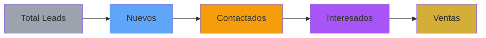
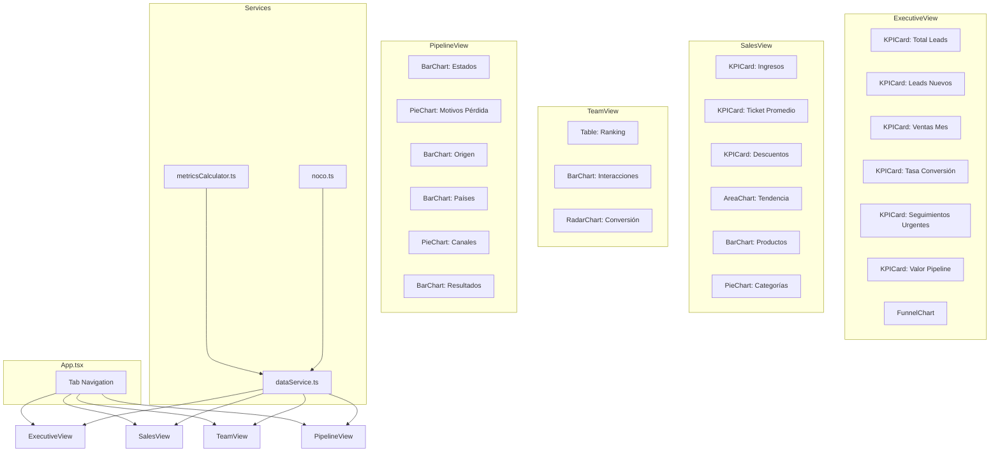

# 📋 PLAN DE IMPLEMENTACIÓN - Dashboard Yani Coach v2.0
## Transformación a 4 Pestañas Profesionales con Métricas Avanzadas

**Fecha:** 2026-02-20  
**Autor:** Arquitecto Lead  
**Versión:** 2.0

---

## 🎯 OBJETIVO

Transformar el dashboard actual de 3 pestañas básicas en un sistema de 4 pestañas profesionales con métricas accionables para la toma de decisiones ejecutivas, manteniendo la arquitectura existente (React 19 + Vite + NocoDB).

---

## 1. ANÁLISIS DEL ESTADO ACTUAL

### 1.1 Arquitectura Existente

| Componente | Estado | Observaciones |
|------------|--------|---------------|
| [`App.tsx`](App.tsx) | ✅ Funcional | 3 tabs: business, team, recovery |
| [`components/BusinessView.tsx`](components/BusinessView.tsx) | ⚠️ Básico | KPIs financieros limitados |
| [`components/TeamView.tsx`](components/TeamView.tsx) | ⚠️ Básico | Solo ranking de vendedoras |
| [`components/RecoveryView.tsx`](components/RecoveryView.tsx) | ⚠️ Inoperativo | Tabla Intentos vacía en NocoDB |
| [`services/noco.ts`](services/noco.ts) | ✅ Funcional | Mapeo correcto de campos |
| [`services/dataService.ts`](services/dataService.ts) | ✅ Funcional | Fallback a mock data |
| [`types.ts`](types.ts) | ✅ Completo | Interfaces bien definidas |

### 1.2 Datos Disponibles en NocoDB

| Tabla | Registros | Campos Relevantes No Utilizados |
|-------|-----------|--------------------------------|
| **Contactos** | 27,676 | `Próximo Contacto`, `Nombre de la Etiqueta` (origen) |
| **Interacciones** | 10,524 | `Resultado` (estado de la interacción) |
| **Ventas** | ~7 | `Descuento Aplicado`, `Tipo de Oferta` |
| **Intentos** | ~1 | ⚠️ Tabla prácticamente vacía |
| **Vendedoras** | 3 | `Estado` (activo/inactivo) |

### 1.3 Brechas Identificadas

1. **No existe vista de Resumen Ejecutivo** con métricas de alto nivel
2. **No hay análisis de pipeline** por estado ni embudo visual
3. **Falta análisis de ventas** por producto, categoría y descuentos
4. **No hay métricas de actividad** por canal ni resultado de interacciones
5. **Campo `Próximo Contacto`** no está mapeado (seguimientos urgentes)
6. **Campo `Nombre de la Etiqueta`** no está mapeado (origen de leads)

---

## 2. ESTRUCTURA DE DATOS NECESARIA

### 2.1 Nuevos Campos a Mapear en `noco.ts`

#### Tabla Contactos
```typescript
// Campos existentes a agregar:
nextContactDate?: string;      // Próximo Contacto (DateTime)
leadSource?: string;           // Nombre de la Etiqueta (from Etiquetas)
productCategory?: string;      // Categoría del producto interesado
```

#### Tabla Ventas
```typescript
// Campos existentes a agregar:
discountApplied?: number;      // Descuento Aplicado
offerType?: string;            // Tipo de Oferta
productCategory?: string;      // Categoría (from Productos via link)
```

#### Tabla Interacciones
```typescript
// Campo existente a agregar:
priority?: string;             // Prioridad
```

### 2.2 Interfaces TypeScript Nuevas

```typescript
// En types.ts - Agregar a la interfaz Contact:
interface Contact {
  // ... campos existentes ...
  nextContactDate?: string;    // Para seguimientos urgentes
  leadSource?: string;         // Para análisis de origen
}

// En types.ts - Agregar a la interfaz Sale:
interface Sale {
  // ... campos existentes ...
  discountApplied?: number;    // Para análisis de descuentos
  offerType?: string;          // Para análisis de ofertas
  productCategory?: string;    // Para agrupación por categoría
}

// Nueva interfaz para métricas agregadas:
interface PipelineMetrics {
  total: number;
  byStatus: Record<LeadStatus, number>;
  estimatedValue: number;
  urgentFollowUps: number;
}

interface SalesMetrics {
  totalRevenue: number;
  avgTicket: number;
  totalDiscounts: number;
  avgDiscount: number;
  byProduct: ProductRevenue[];
  byCategory: CategoryRevenue[];
  byWeek: WeeklyRevenue[];
}

interface SellerMetrics {
  sellerId: string;
  sellerName: string;
  salesCount: number;
  revenue: number;
  interactionsCount: number;
  conversionRate: number;
  avgDaysToClose: number;
  activeLeads: number;
  pendingFollowUps: number;
}

interface ActivityMetrics {
  totalInteractions: number;
  avgPerLead: number;
  byChannel: ChannelMetric[];
  byResult: ResultMetric[];
}
```

---

## 3. FÓRMULAS EXACTAS PARA CADA MÉTRICA

### 3.1 Pestaña 1: Resumen Ejecutivo

| Métrica | Fórmula | Pseudocódigo |
|---------|---------|--------------|
| **Total Leads Pipeline** | Count de Contactos donde `status ∉ [CLOSED_WON, CLOSED_LOST]` | `contacts.filter(c => c.status !== CLOSED_WON && c.status !== CLOSED_LOST).length` |
| **Leads Nuevos Sin Tocar Hoy** | Count de Contactos donde `status = NEW` Y `createdAt = today` | `contacts.filter(c => c.status === NEW && isToday(c.createdAt)).length` |
| **Ventas del Mes** | Sum de `amount` donde `date` está en mes actual | `sales.filter(s => isCurrentMonth(s.date)).reduce((sum, s) => sum + s.amount, 0)` |
| **Tasa de Conversión** | `(Ganados / (Ganados + Perdidos)) × 100` | `(closedWon / (closedWon + closedLost)) * 100` |
| **Seguimientos Urgentes Hoy** | Count donde `nextContactDate = today` | `contacts.filter(c => isToday(c.nextContactDate)).length` |
| **Valor Estimado Pipeline** | Sum de `estimatedValue` de leads activos | `contacts.filter(isActive).reduce((sum, c) => sum + (c.estimatedValue || 0), 0)` |

### 3.2 Pestaña 2: Ventas & Ingresos

| Métrica | Fórmula | Pseudocódigo |
|---------|---------|--------------|
| **Ingresos Totales Mes** | Sum `amount` filtrado por mes | `sales.filter(isCurrentMonth).reduce((sum, s) => sum + s.amount, 0)` |
| **Ingreso por Producto** | Group by `productName`, Sum `amount` | `groupBy(sales, 'productName').map(g => ({name: g.key, value: sum(g.amount)}))` |
| **Ingreso por Categoría** | Group by `productCategory`, Sum `amount` | `groupBy(sales, 'productCategory').map(g => ({name: g.key, value: sum(g.amount)}))` |
| **Total Descuentos** | Sum `discountApplied` | `sales.reduce((sum, s) => sum + (s.discountApplied || 0), 0)` |
| **Promedio Descuento** | Avg `discountApplied` donde `discountApplied > 0` | `sales.filter(s => s.discountApplied > 0).reduce((sum, s) => sum + s.discountApplied, 0) / count` |
| **Ticket Promedio** | `totalRevenue / salesCount` | `totalRevenue / sales.length` |

### 3.3 Pestaña 3: Desempeño de Vendedoras

| Métrica | Fórmula | Pseudocódigo |
|---------|---------|--------------|
| **Ventas por Vendedora (#)** | Count group by `sellerId` | `groupBy(sales, 'sellerId').map(g => ({sellerId: g.key, count: g.length}))` |
| **Ventas por Vendedora ($)** | Sum `amount` group by `sellerId` | `groupBy(sales, 'sellerId').map(g => ({sellerId: g.key, revenue: sum(g.amount)}))` |
| **Interacciones por Vendedora** | Count group by `sellerId` | `groupBy(interactions, 'sellerId').map(g => ({sellerId: g.key, count: g.length}))` |
| **Tasa Conversión por Vendedora** | `(Ventas de Vendedora / Contactos Asignados) × 100` | `sellerSales / sellerContacts * 100` |
| **Días Promedio para Cerrar** | Avg `salesCycleDays` por vendedora | `sales.filter(s => s.sellerId === id).reduce((sum, s) => sum + s.salesCycleDays, 0) / count` |
| **Leads Activos Asignados** | Count contacts donde `assignedSellerId = id` Y `status = activo` | `contacts.filter(c => c.assignedSellerId === id && isActive(c.status)).length` |
| **Seguimientos Pendientes** | Count donde `assignedSellerId = id` Y `nextContactDate <= today` | `contacts.filter(c => c.assignedSellerId === id && c.nextContactDate <= today).length` |

### 3.4 Pestaña 4: Pipeline & Actividad

| Métrica | Fórmula | Pseudocódigo |
|---------|---------|--------------|
| **Leads por Estado** | Count group by `status` | `groupBy(contacts, 'status').map(g => ({status: g.key, count: g.length}))` |
| **Leads Perdidos y Motivos** | Count donde `status = CLOSED_LOST` group by `lostReason` | `contacts.filter(c => c.status === CLOSED_LOST).groupBy('lostReason')` |
| **Origen de Leads** | Count group by `leadSource` | `groupBy(contacts, 'leadSource').map(g => ({source: g.key, count: g.length}))` |
| **Leads por País** | Count group by `country` | `groupBy(contacts, 'country').map(g => ({country: g.key, count: g.length}))` |
| **Total Interacciones Mes** | Count donde `date` en mes actual | `interactions.filter(i => isCurrentMonth(i.date)).length` |
| **Promedio Interacciones/Lead** | `totalInteractions / uniqueContactIds` | `interactions.length / new Set(interactions.map(i => i.contactId)).size` |
| **Interacciones por Canal** | Count group by `type` | `groupBy(interactions, 'type').map(g => ({channel: g.key, count: g.length}))` |
| **Resultado Interacciones** | Count group by `result` | `groupBy(interactions, 'result').map(g => ({result: g.key, count: g.length}))` |

---

## 4. TIPOS DE GRÁFICOS RECOMENDADOS

### 4.1 Pestaña 1: Resumen Ejecutivo

| Gráfico | Tipo | Justificación |
|---------|------|---------------|
| **Embudo por Estado** | `BarChart` horizontal | Muestra progresión del pipeline de forma visual |
| **KPIs Principales** | `KPICard` x 6 | Lectura rápida de métricas clave |



### 4.2 Pestaña 2: Ventas & Ingresos

| Gráfico | Tipo | Justificación |
|---------|------|---------------|
| **Ventas por Semana/Mes** | `AreaChart` | Muestra tendencia temporal con área rellena |
| **Productos Más Vendidos** | `BarChart` horizontal | Ranking claro de productos por ingresos |
| **Mix por Categoría** | `PieChart` (Donut) | Proporción visual de categorías |
| **Descuentos Aplicados** | `BarChart` comparativo | Total vs Promedio |

### 4.3 Pestaña 3: Desempeño de Vendedoras

| Gráfico | Tipo | Justificación |
|---------|------|---------------|
| **Ranking de Vendedoras** | `Table` con badges | Comparación detallada de métricas |
| **Interacciones por Tipo/Vendedora** | `BarChart` stacked | Distribución de canales por vendedora |
| **Conversión por Vendedora** | `RadarChart` | Comparación multidimensional |

### 4.4 Pestaña 4: Pipeline & Actividad

| Gráfico | Tipo | Justificación |
|---------|------|---------------|
| **Leads por Estado** | `BarChart` horizontal | Distribución del pipeline |
| **Motivos de Pérdida** | `PieChart` (Donut) | Proporción de razones |
| **Origen de Leads** | `BarChart` horizontal | Fuentes de captación |
| **Leads por País** | `BarChart` o `Treemap` | Distribución geográfica |
| **Interacciones por Canal** | `PieChart` | Distribución de canales |
| **Resultado Interacciones** | `BarChart` | Estados de interacciones |

---

## 5. ARQUITECTURA DE COMPONENTES

### 5.1 Nueva Estructura de Archivos

```
src/
├── components/
│   ├── ExecutiveView.tsx        # NUEVO - Pestaña 1
│   ├── SalesView.tsx            # NUEVO - Pestaña 2
│   ├── TeamView.tsx             # MODIFICAR - Pestaña 3
│   ├── PipelineView.tsx         # NUEVO - Pestaña 4
│   ├── KPICard.tsx              # EXISTENTE - Reutilizar
│   ├── DateRangePicker.tsx      # EXISTENTE - Reutilizar
│   └── charts/                  # NUEVO - Gráficos reutilizables
│       ├── FunnelChart.tsx
│       ├── StatusDistributionChart.tsx
│       └── TrendChart.tsx
├── services/
│   ├── noco.ts                  # MODIFICAR - Agregar campos
│   ├── dataService.ts           # MODIFICAR - Agregar funciones
│   └── metricsCalculator.ts     # NUEVO - Cálculos centralizados
├── types.ts                     # MODIFICAR - Nuevas interfaces
├── config.ts                    # EXISTENTE - Sin cambios
└── App.tsx                      # MODIFICAR - 4 pestañas
```

### 5.2 Diagrama de Componentes



---

## 6. ORDEN DE IMPLEMENTACIÓN

### Fase 1: Preparación de Datos (Prioridad Alta)

1. **MODIFICAR** [`types.ts`](types.ts) - Agregar nuevos campos a interfaces
2. **MODIFICAR** [`services/noco.ts`](services/noco.ts) - Mapear campos faltantes:
   - `nextContactDate` (Próximo Contacto)
   - `leadSource` (Nombre de la Etiqueta)
   - `discountApplied` (Descuento Aplicado)
   - `offerType` (Tipo de Oferta)
   - `productCategory` (categoría del producto vinculado)

### Fase 2: Servicios de Métricas (Prioridad Alta)

3. **CREAR** `services/metricsCalculator.ts` - Funciones de cálculo:
   - `calculatePipelineMetrics(contacts)`
   - `calculateSalesMetrics(sales)`
   - `calculateSellerMetrics(sellers, sales, contacts, interactions)`
   - `calculateActivityMetrics(interactions)`

### Fase 3: Pestaña 1 - Resumen Ejecutivo (Prioridad Crítica)

4. **CREAR** `components/ExecutiveView.tsx`
5. **MODIFICAR** [`App.tsx`](App.tsx) - Agregar tab "Resumen Ejecutivo"
6. Implementar KPIs con [`KPICard`](components/KPICard.tsx)
7. Implementar gráfico de embudo

### Fase 4: Pestaña 2 - Ventas & Ingresos (Prioridad Alta)

8. **CREAR** `components/SalesView.tsx`
9. Implementar KPIs de ventas
10. Implementar gráficos de tendencia y productos

### Fase 5: Pestaña 3 - Desempeño de Vendedoras (Prioridad Media)

11. **MODIFICAR** [`components/TeamView.tsx`](components/TeamView.tsx)
12. Agregar métricas de seguimientos pendientes
13. Mejorar tabla de ranking con más columnas

### Fase 6: Pestaña 4 - Pipeline & Actividad (Prioridad Media)

14. **CREAR** `components/PipelineView.tsx`
15. Implementar análisis de pipeline por estado
16. Implementar análisis de motivos de pérdida
17. Implementar gráficos de actividad

### Fase 7: Integración y Testing (Prioridad Alta)

18. Integrar todas las pestañas en [`App.tsx`](App.tsx)
19. Verificar que el filtro de fechas funcione en todas las vistas
20. Probar con datos reales de NocoDB
21. Probar fallback a mock data

---

## 7. CONSIDERACIONES UX

### 7.1 Para Usuario No Técnico

| Aspecto | Recomendación |
|---------|---------------|
| **Tooltips** | Agregar explicación breve en cada KPI (ya existe en [`KPICard`](components/KPICard.tsx)) |
| **Colores** | Usar semántica consistente: 🟡 Gold=Principal, 🟢 Verde=Éxito, 🔴 Rojo=Peligro, 🟠 Amber=Advertencia |
| **Números** | Formatear con separadores de miles y símbolo de moneda |
| **Porcentajes** | Mostrar con 1 decimal máximo |
| **Fechas** | Usar formato local (es-CO) |
| **Vacío** | Mostrar "Sin datos" en lugar de 0 o espacios vacíos |

### 7.2 Acciones Recomendadas

| Métrica | Si es Alto | Si es Bajo |
|---------|------------|------------|
| **Tasa Conversión** | ✅ Replicar estrategia | ⚠️ Revisar proceso de venta |
| **Leads Estancados** | ⚠️ Reactivar o archivar | ✅ Pipeline saludable |
| **Seguimientos Urgentes** | ⚠️ Priorizar hoy | ✅ Al día |
| **Descuentos** | ⚠️ Revisar rentabilidad | ✅ Precios sostenidos |

### 7.3 Responsive Design

- **Desktop (≥1024px):** Grid de 4 columnas para KPIs
- **Tablet (768-1023px):** Grid de 2 columnas
- **Mobile (<768px):** Stack vertical, gráficos simplificados

---

## 8. RIESGOS Y MITIGACIONES

| Riesgo | Probabilidad | Impacto | Mitigación |
|--------|--------------|---------|------------|
| **Tabla Ventas vacía** | Alta | Crítico | Usar mock data para demo, mostrar aviso |
| **Campo `Próximo Contacto` vacío** | Media | Medio | Fallback a "Sin seguimientos pendientes" |
| **Campo `leadSource` vacío** | Media | Bajo | Mostrar "Sin origen definido" |
| **Rendimiento con 27K contactos** | Alta | Alto | Implementar paginación server-side |
| **Campos de descuento vacíos** | Alta | Bajo | Mostrar "Sin descuentos aplicados" |

---

## 9. DEFINITION OF DONE

### ✅ Criterios de Aceptación

- [ ] **4 pestañas funcionales** en el dashboard
- [ ] **Todas las métricas calculadas** según fórmulas definidas
- [ ] **Gráficos renderizados** correctamente con Recharts
- [ ] **Filtro de fechas** funciona en todas las pestañas
- [ ] **Fallback a mock data** funciona sin credenciales
- [ ] **Tooltips informativos** en cada KPI
- [ ] **Colores consistentes** con la paleta gold/emerald/red/amber
- [ ] **Responsive design** para móvil y desktop
- [ ] **Sin errores de TypeScript** (strict mode)
- [ ] **Código sin `any`** (tipado estricto)

### ✅ Tests Manuales

1. Cambiar entre pestañas sin errores
2. Cambiar rango de fechas y verificar actualización
3. Verificar que KPIs coinciden con datos de NocoDB
4. Verificar que gráficos se renderizan correctamente
5. Verificar modo demo sin credenciales

---

## 10. SUBTAREAS PARA CODE MODE

### Sprint 1: Preparación
1. Modificar `types.ts` con nuevos campos
2. Modificar `noco.ts` para mapear campos faltantes
3. Crear `metricsCalculator.ts` con funciones de cálculo

### Sprint 2: Pestaña 1
4. Crear `ExecutiveView.tsx` con estructura base
5. Implementar KPIs de Resumen Ejecutivo
6. Implementar gráfico de embudo

### Sprint 3: Pestaña 2
7. Crear `SalesView.tsx` con estructura base
8. Implementar KPIs de Ventas
9. Implementar gráficos de ventas

### Sprint 4: Pestaña 3
10. Modificar `TeamView.tsx` con nuevas métricas
11. Agregar seguimientos pendientes por vendedora

### Sprint 5: Pestaña 4
12. Crear `PipelineView.tsx` con estructura base
13. Implementar análisis de pipeline
14. Implementar gráficos de actividad

### Sprint 6: Integración
15. Modificar `App.tsx` con 4 pestañas
16. Verificar integración completa
17. Testing y ajustes finales

---

**FIN DEL PLAN**
